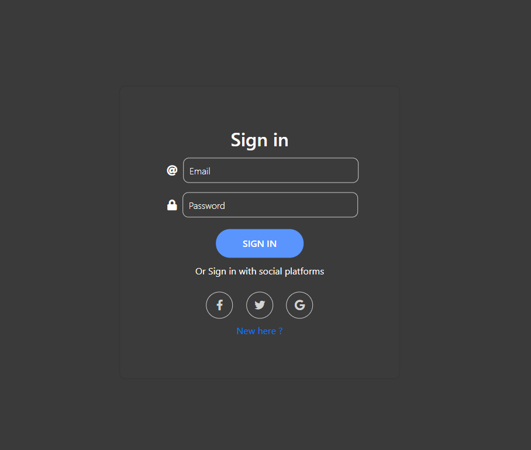
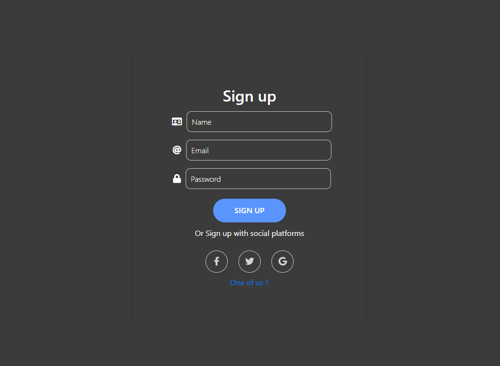
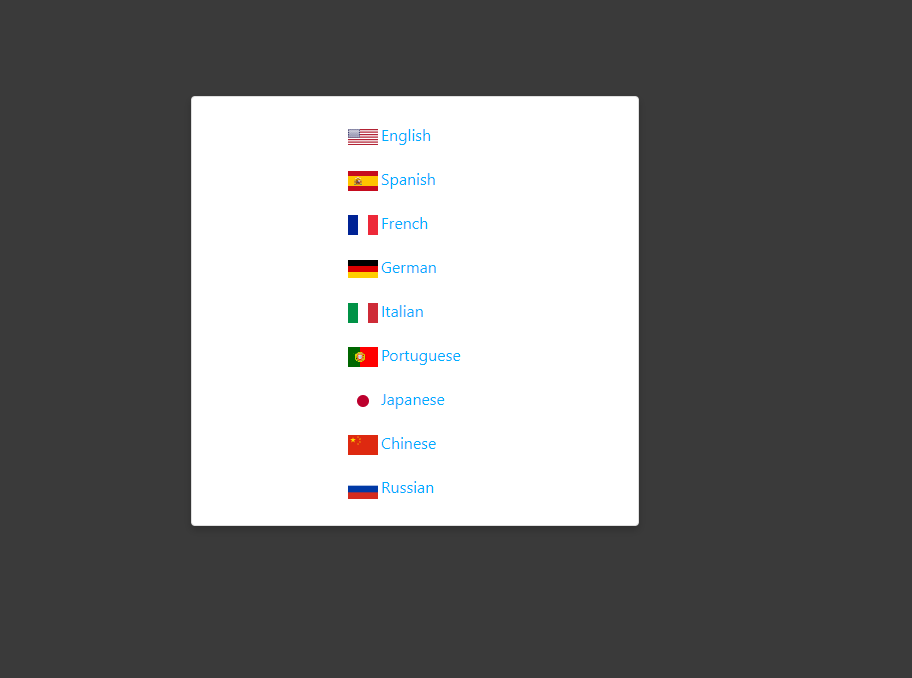
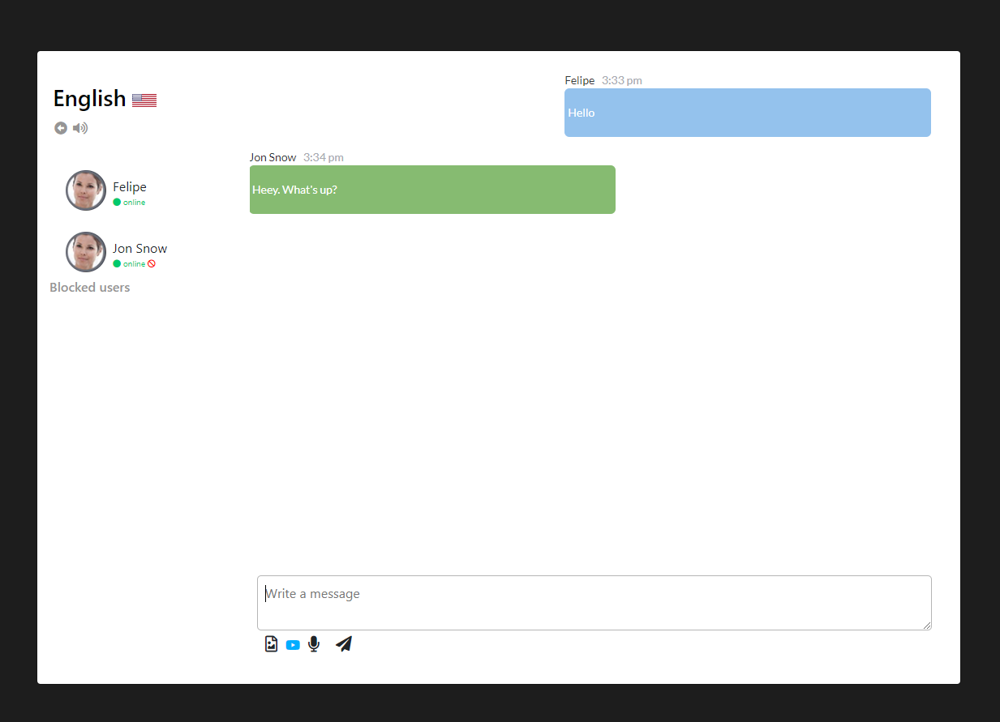
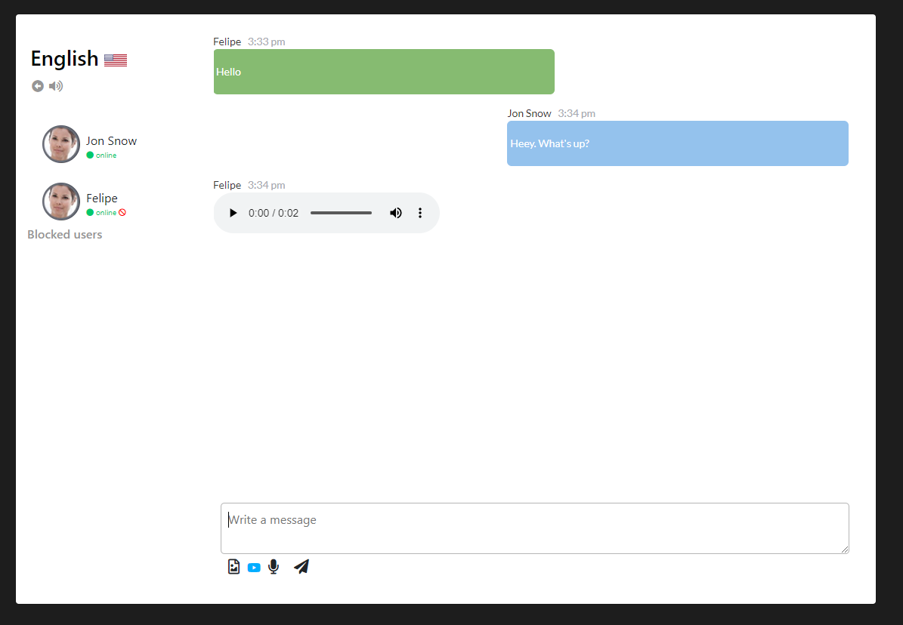

<h1 align="center">Welcome to chat-front-angular 👋</h1>
<p>
  <a href="https://www.npmjs.com/package/svelte-app" target="_blank">
    
  </a>
</p>

> Chat app using Angular.


## Features

```sh
- Sign In / Sign Up
- Rooms
- Chat audios (enable / disable)
- Block/unblock users
- Record and play audios
- Allow embeded youtube video on messages
```

## Examples
Sign In






## Install

```sh
npm install
```

## Usage

```sh
ng serve
```

## Run tests

```sh
npm test (work in progress)
```

## Author

👤 **Felipe C. Bento**

* Website: linkedin.com/in/felipe-bento
* Github: [@fcbento](https://github.com/fcbento)
* LinkedIn: [@felipe-bento](https://linkedin.com/in/felipe-bento)

## Show your support

Give a ⭐️ if this project helped you!

***
_This README was generated with ❤️ by [readme-md-generator](https://github.com/kefranabg/readme-md-generator)_